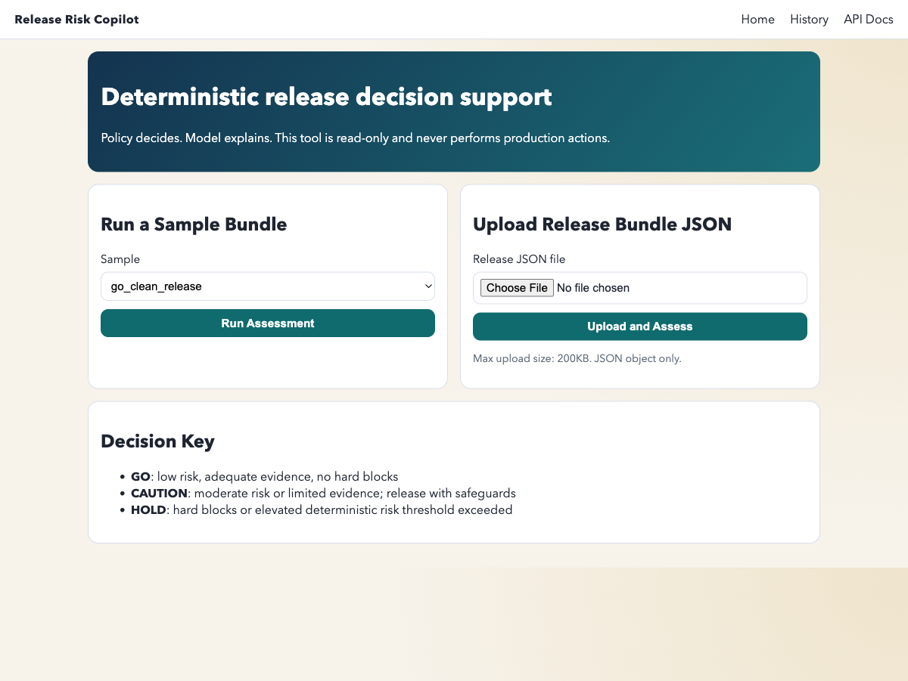
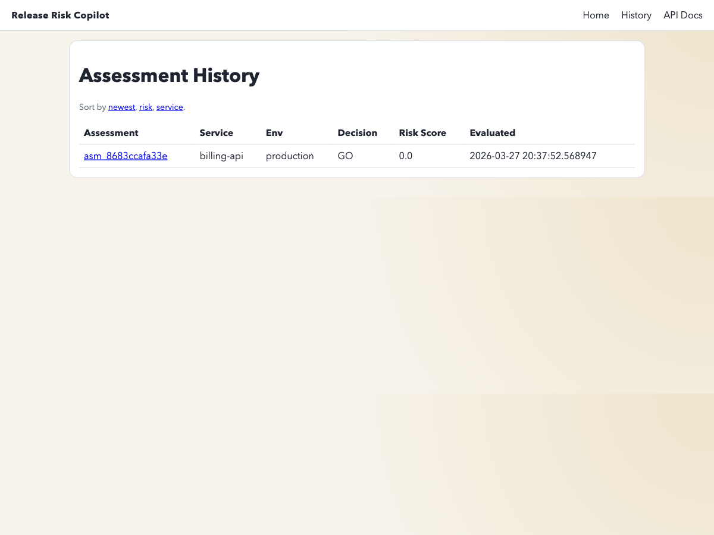
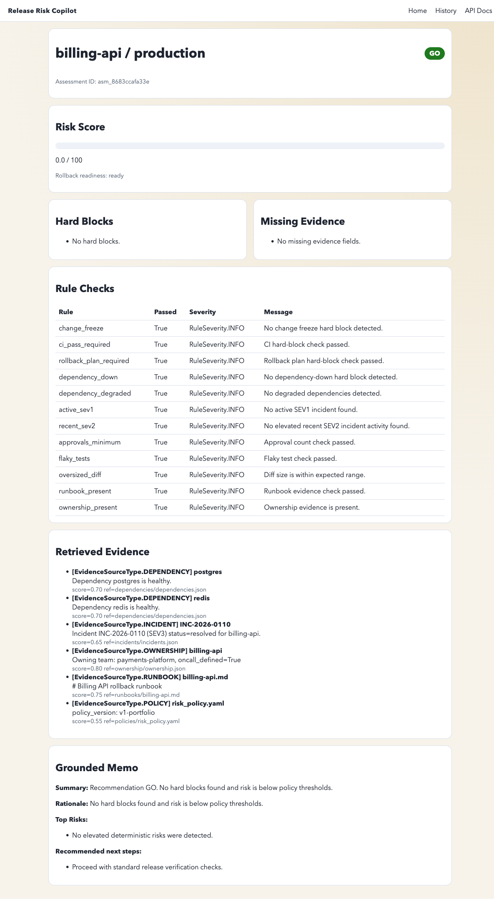

# Release Risk Copilot (v1 Demo)

Release Risk Copilot is a deterministic, read-only release decision support tool.
Policy-first release risk assessment with deterministic rules, evidence retrieval, and AI-generated explanations.

## Why this matters
- Reduces false-GO risk by making hard-block checks explicit and deterministic.
- Keeps humans in control of release decisions while improving preflight consistency.
- Creates auditable release assessments that can be reviewed, tested, and iterated safely.

It evaluates a release bundle and returns:
- final decision: `GO` / `CAUTION` / `HOLD`
- risk score (`0-100`)
- hard blocks and triggered checks
- evidence coverage and missing evidence
- rollback readiness
- retrieved local evidence
- grounded memo (mock or OpenAI-backed explanation)

## Problem statement
Teams often need fast release decisions under uncertainty. A pure LLM approach can hide policy logic and produce inconsistent outcomes.

This project intentionally makes the decision engine deterministic and inspectable, then uses the model only to explain the already-computed result.

## Why deterministic policy comes first
Core principle:
- Policy decides.
- Model explains.

Guardrails:
- No production actions.
- No auto-approval.
- No hidden authority in model output.
- Hard blocks and policy thresholds are deterministic code.

## Architecture (ASCII)

```text
ReleaseBundle JSON
       |
       v
[1] Input Validation (Pydantic)
       |
       v
[2] Local Retrieval (dependencies/incidents/ownership/runbooks/policies)
       |
       v
[3] Deterministic Rules Engine
       |
       v
[4] Risk Scoring (0..100 clamp)
       |
       v
[5] Evidence Coverage Calculation
       |
       v
[6] Deterministic Decision Policy (GO/CAUTION/HOLD)
       |
       +--> [7a] Mock Memo Provider (default, deterministic)
       |
       +--> [7b] OpenAI Memo Provider (optional, backend-only + fallback)
       |
       v
[8] Persistence (SQLite + SQLAlchemy)
       |
       v
[9] API + Server-rendered Web UI
```

## Current feature set
- FastAPI backend with preserved MVP endpoints:
  - `GET /health`
  - `GET /samples`
  - `POST /assessments`
- Additional API endpoints:
  - `GET /api/assessments/history`
  - `GET /api/assessments/{assessment_id}`
- Web UI (Jinja2 + minimal JS):
  - `GET /` (home, sample picker, upload)
  - `GET /history`
  - `GET /assessments/{assessment_id}`
  - `POST /assessments/run-sample`
  - `POST /assessments/upload`
- SQLite persistence of completed assessments
- Deterministic retrieval over local corpora
- Richer deterministic rule checks and evidence coverage downgrade behavior
- Config-backed risk policy via `data/policies/risk_policy.yaml`
- OpenAI explanation provider behind provider interface with deterministic fallback
- Notebook scaffolds for supporting-data inspection and scenario evaluation
- CI workflow for test execution

## Local setup

```bash
cd release-risk-copilot
python3.11 -m venv .venv
source .venv/bin/activate
pip install -r requirements.txt
cp .env.example .env
PYTHONPATH=. uvicorn app.main:app --reload
```

Open:
- App UI: `http://127.0.0.1:8000/`
- API docs: `http://127.0.0.1:8000/docs`

## Environment variables
See `.env.example`.

Key values:
- `OPENAI_API_KEY` (optional; if unset app runs in mock mode)
- `OPENAI_MODEL` (default `gpt-5-mini`)
- `DATABASE_URL` (default SQLite local file)
- `UPLOAD_MAX_BYTES` (JSON upload cap)

## Mock mode
If `OPENAI_API_KEY` is not set:
- app stays fully functional
- memo provider is deterministic mock
- decision policy behavior is unchanged

Check mode via:
- `GET /health` -> `provider_mode`

## Heroku deployment
This repo is Heroku-ready with:
- `Procfile`
- `runtime.txt`
- dependency-pinned `requirements.txt`

Minimal flow:
1. Create Heroku app.
2. Set config vars (`OPENAI_API_KEY` optional).
3. Deploy from main branch.

## Screenshots (placeholders)




## Testing

```bash
cd release-risk-copilot
source .venv/bin/activate
PYTHONPATH=. pytest -q
```

Current suite covers:
- existing MVP behavior
- persistence/history/detail retrieval
- retrieval logic
- coverage downgrade behavior
- OpenAI schema fallback behavior
- web routes and upload flow
- OpenAPI request example validity
- mock mode when no OpenAI key is configured

## Roadmap
- Add richer scenario generation in notebooks
- Add richer evidence citation formatting in UI
- Optional policy editing UI for demo use
- Extend deterministic scoring explainability breakdown per weight
